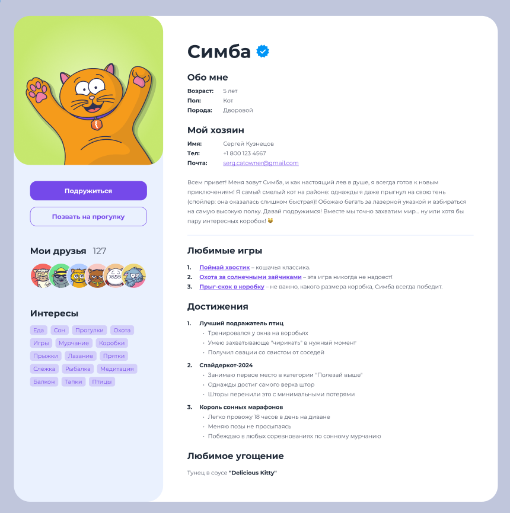

# 🐱 Social Media Cats (Социальная сеть для кошек)

The work is presented as a design mockup of a social network for cats and their owners /
Работа представлена в виде дизайнерского макета социальной сети для кошек и их владельцев.



## 🧮 Functional features (Функциональные особенности):
- Browsing the feed / Просмотр ленты
- Adding fluffy friends / Добавление пушистых друзей
- Uploading photos of pets / Загрузка фотографий питомцев
- Likes and notifications service / Сервис лайков и уведомлений

## 🛠 Technologies (Технологии):
- HTML5
- CSS Modules
- CSS3

## 🚀 Project launch (Запуск проекта)

### Installation (Установка)
```bash
git clone https://github.com/iDolph1n/social_media_cats.git
cd social_media_cats
npm install
```

## 🤝 How to support the project (Как помочь проекту):

1. Fork the repository / Скопируйте репозиторий.
2.  Create a branch for the feature or fix / Создайте ветку для функции или исправления.
3.  Push the changes / Отправьте изменения.
4.  Initiate a pull request / Инициировать запрос на слияние изменений.

## 📄 License MIT (Лицензия)

The project is licensed under the MIT License. For more details, see the [LICENSE](./LICENSE/) file /
Проект распространяется под лицензией MIT. Ознакомиться подробнее можно в файле [LICENSE](./LICENSE/).

___

> С уваженеи, [iDolph1n](https://github.com/iDolph1n)